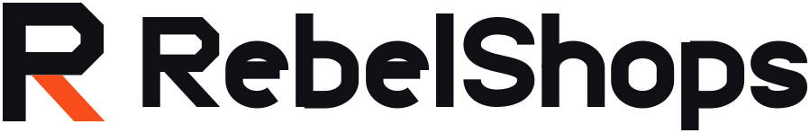
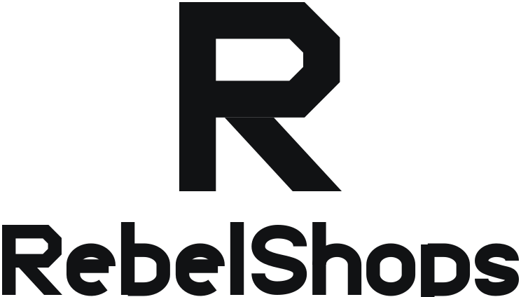
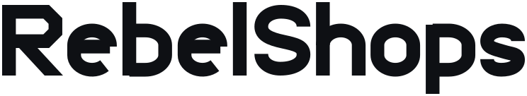

# RebelShops — Visual Identity

> Companion to `docs/design-system.md`. That file owns color, type and UI tokens and wins any
> conflict. This file owns the mark, the wordmark, the lockups and the rules for using them.
> Every asset here is generated by `public/brand/generate.js` — edit the script, not the SVGs.

---

## 1. The idea

RebelShops sells one argument: **you already own the valuable part.** The seller's catalog, SKUs,
stock levels and warehouses are already sitting in ShipStation. We are not the inventory system, the
shipping workflow, or the business. We are the shop window cut into something they already built.

The mark is an **R die-cut and folded from board.**

- The **bowl** is a closed panel with its two right-hand corners **cut at 45 degrees** — the corner
  you get when a carton is knocked flat, not the corner you get from a circle. That cut is the
  identity's signature; it is the one thing no other R does.
- The **aperture** — the wide horizontal slot inside the bowl — is the shop window. It is the only
  opening in an otherwise closed form. That asymmetry is the whole positioning: the catalog is
  already sealed and finished, and the product is the opening.
- The **leg** is not a leg. It is a **flap folded out** from under the bowl: a quadrilateral with a
  horizontal top edge and a foot that lands flat on the baseline. It is the only part in **ember**,
  because it is the only part that is us. Everything ink is what the seller already had.

Four directions were drawn and reviewed at 16px before this one was chosen: a parcel with a
projecting awning, a shipping label whose payload block becomes a lit window, a hanging swallowtail
shop sign, and this monogram. The awning collapsed into a Monopoly house, the label turned to mush
below 32px, and the pennant read as a bookmark icon. Only the monogram survived the favicon and
carried a specific idea rather than a category cliché.

**What the mark deliberately is not:** a shopping cart, a bag, a storefront-with-awning glyph, a
fist, a flame, or anything with a gradient in it.

---

## 2. Construction

One metric system produces the mark and the wordmark, which is why they can never drift apart in
weight: **the mark is literally the R that opens the word.** In the lockups it is the same path data
at a larger scale, with the flap switched to ember.

| Metric | Value (cap-height units) |
|---|---|
| Cap height | `100` |
| Stem weight | `19.4` (19.4% of cap — a bold grotesque) |
| x-height | `72` |
| Ascender / descender | `-4` / `126` |
| Round-letter overshoot | `1.5` |
| Round-letter outer width (`o e b p h`) | `70` |
| Straight side on round letters | `14` (2 × 7), with elliptical corners |
| Tracking between glyph outer edges | `9` |
| Kerning pairs | `Re -3 · eb -1 · be -1 · el -1 · lS +2 · Sh -1 · ho -2 · op -1 · ps -2` |
| Wordmark advance | `738.4` |

**The R**

| Detail | Value |
|---|---|
| Bowl outer bottom | `61` |
| Bowl outer right | `85` |
| 45° cut on the bowl's right corners | `13` |
| Aperture (the window) | `22.2` tall — the bowl minus two stems |
| Flap: top edge | `x 24 → 50` at `y 61` |
| Flap: foot on the baseline | `x 60 → 86` |
| Total advance | `86 × 100` |

Round letters are **flat-sided** — a straight vertical at the extremes with elliptical corners —
which is what puts them in the same family as the R's straight cuts rather than fighting them. The
letterforms are drawn as stroked skeletons at a single weight, so no part of the identity can carry
a different stroke weight from any other part.

Nothing in this identity references a font family. `Space Grotesk` and `Inter` are the *UI* faces
per design-system §3; the wordmark is drawn and must always be used as artwork.

---

## 3. The lockups

### Mark


`viewBox="-17 -10 120 120"`. The R (86 × 100) sits centred in a 120-unit square: 17 units of side
air, 10 top and bottom. Use it standalone wherever the name is already present — app chrome, the
favicon, an avatar, a loading state.

### Horizontal lockup — the default



`viewBox="-3 -3 899.92 148"`, aspect **6.08 : 1**. The mark stands at **1.32×** the wordmark's cap
height and is centred on the word's cap-to-baseline midline, not on its bounding box. The gap
between the mark's right edge and the word is **42** cap units. Use in the top nav, the footer, email
headers, and anywhere the horizontal room exists.

### Stacked lockup



`viewBox="-3 -3 744.4 424"`, aspect **1.76 : 1**. Mark at **2.7×** cap height, centred over the word,
gap **48**. Use only in square or portrait spaces — a splash screen, a print block, a share card
where the horizontal lockup would have to shrink below its minimum.

### Wordmark



`viewBox="-3 -7 744.4 136"`, aspect **5.47 : 1**. The name without the badge. Use when the mark
already appears elsewhere in the same view — two Rs in one header is a mistake.

---

## 4. Clear space

**Clear space on all four sides = one quarter of the monogram's height** in whichever lockup you are
using. Nothing — no type, no rule, no image edge, no button — enters it.

| Asset | Clear space as a fraction of the rendered box height | Example |
|---|---|---|
| `mark.svg` | `0.21 × H` | at 32px → **7px** |
| `logo-horizontal.svg` | `0.22 × H` | at 220px wide (36px tall) → **8px** |
| `logo-stacked.svg` | `0.16 × H` | at 200px wide (114px tall) → **18px** |
| `wordmark.svg` | `0.25 × H` (a quarter of the cap height) | at 240px wide (44px tall) → **11px** |

---

## 5. Minimum sizes

Every floor below was checked by rasterising the real file at that exact pixel size and inspecting
the pixel grid — not by eyeballing a scaled preview.

| Asset | Minimum | What fails below it |
|---|---|---|
| `mark.svg` / `mark-inverse.svg` | **16px** tall | the aperture closes and the R fills in |
| The tile (`favicon.ico`, `icon-*.png`) | **16px** | — this is the size it was tuned for |
| `wordmark.svg` | **96px** wide | the `e` and `s` counters close |
| `logo-horizontal.svg` | **128px** wide | as above; the mark also drops under 20px |
| `logo-stacked.svg` | **112px** wide | the word goes below its own floor |

Below 16px, do not scale anything down — use the tile, or drop the mark entirely.

---

## 6. Color pairings

Grounds and the file that belongs on them. All tokens are from design-system §2.

| Ground | Use | Why |
|---|---|---|
| `--paper` `--paper-raised` `--paper-sunken` `--ink-50` `--ink-100` | `mark.svg`, `wordmark.svg`, `logo-horizontal.svg`, `logo-stacked.svg` | ink-900 on paper is 17.4:1 |
| `--ink-950` `--ink-900` `--ink-800` `--ink-700` | the `-inverse` files | paper on ink-950 is 18.9:1 |
| `--ember-500` `--ember-600` and any saturated fill | the `-mono` files, with `color: var(--paper)` | see the warning below |
| `--mint-500` `--rose-500` `--amber-500` | the `-mono` files, paper | |
| Photography, video, unknown grounds | the `-mono` files, on a solid plate | never float artwork over an image |

> **The ember trap.** On an ember ground the ember flap disappears and the mark reads as a **P**.
> This is the single most likely way to get the identity wrong. On anything ember, use
> `mark-mono.svg` / `logo-horizontal-mono.svg` / `logo-stacked-mono.svg`, which paint every part in
> `currentColor`.

The `-mono` files take their color from CSS `currentColor`, so one file covers ink-on-paper,
paper-on-ink and paper-on-ember. Prefer them anywhere the surface color is dynamic.

The ember flap is never the sole carrier of meaning: the mark is a complete, legible R when the
flap is the same color as the stem.

---

## 7. Correct and incorrect

**Do**

- Use the shipped files. They are generated, not traced.
- Pick the variant that matches the ground (§6), then let it be one flat color plus, at most, ember.
- Scale proportionally from the SVG. It has no rasters and no font references in it.
- Give it clear space (§4) and respect the floor (§5).

**Do not**

1. **Do not put `mark.svg` or `mark-inverse.svg` on an ember ground.** The flap vanishes; you get a P.
2. **Do not re-set the wordmark in Space Grotesk** — or any font. The drawn letterforms have
   flat-sided rounds and a cut R that no released typeface has. Typing the name is not the wordmark.
3. **Do not recolor the flap** to anything but `--ember-500` or the foreground color.
4. **Do not add** a gradient, bevel, inner shadow, glow, outline or drop shadow. If the mark needs a
   shadow to separate from the ground, the ground is wrong.
5. **Do not change the mark-to-word ratio, the gap, or the vertical alignment** in a lockup. Build a
   new lockup by editing `generate.js`, never by moving pieces in a design tool.
6. **Do not stretch, skew, rotate, mirror, or outline** the mark.
7. **Do not enclose** the mark in a circle, a badge, or any rounded square other than the shipped
   tile.
8. **Do not respell it.** `RebelShops` — one word, capital R, capital S. Not `Rebel Shops`, not
   `RebelShop`, not `REBELSHOPS`. See marketing-copy §0.
9. **Do not place a full-color lockup over photography.** Solid plate, mono file.
10. **Do not revive the shopping-cart glyph.** It is retired.

---

## 8. Where the files live

### `public/brand/`

| File | What it is |
|---|---|
| `mark.svg` | monogram, ink-900 + ember, for light grounds |
| `mark-inverse.svg` | monogram, paper + ember, for dark grounds |
| `mark-mono.svg` | monogram, all `currentColor` — ember grounds, photography, single-color print |
| `wordmark.svg` · `wordmark-inverse.svg` · `wordmark-mono.svg` | the drawn name, no badge |
| `logo-horizontal.svg` · `-inverse` · `-mono` | default lockup, 6.08 : 1 |
| `logo-stacked.svg` · `-inverse` · `-mono` | square/portrait lockup, 1.76 : 1 |
| `icon-512.png` · `icon-192.png` | the tile — paper R on an ember rounded square, PWA/manifest sizes |
| `apple-touch-icon.png` | 180×180, full-bleed ember square (iOS applies its own mask) |
| `og-image.png` | 1200×630 social card |
| `generate.js` | **the source of truth.** Everything above is its output |

### Root `public/`

| File | What it is |
|---|---|
| `favicon.ico` | multi-size ICO — 16 / 32 / 48, PNG payloads, the ember tile |
| `icon.svg` | the ember tile as vector |
| `apple-icon.png` | 180×180, same artwork as `brand/apple-touch-icon.png` |
| `logo.png` | horizontal lockup, ink, transparent, 1200 × 197 — for contexts that cannot take SVG |

### `src/app/`

| File | What it is |
|---|---|
| `icon.tsx` | Next 15 file convention. `ImageResponse` renders the tile at 32×32 from an inlined SVG data URI. No typeface, no disk reads, so it cannot fail a build |
| `opengraph-image.tsx` | Next 15 file convention. `ImageResponse` renders the 1200×630 card, composed to match `public/brand/og-image.png` |

**Which OG image wins.** If `src/app/opengraph-image.tsx` is present, Next uses it for `og:image`
automatically. It renders the lockup as vector and the copy in a system grotesque stack, falling
back to the face bundled with `next/og`. `public/brand/og-image.png` is the same composition set in
Geist at semibold and is the higher-fidelity artifact; to use it instead, set `openGraph.images`
explicitly in metadata, which overrides the file convention.

---

## 9. Wiring it up

The logo component (`src/components/ui/`) should render these files rather than re-drawing paths.
Inline `mark-mono.svg` / `logo-horizontal-mono.svg` and set `color` from the surrounding theme, or
reference the color-specific files with `` where the ground is known and static. Do not
reimplement the geometry in JSX — it will drift.

## 10. Regenerating

```bash
node public/brand/generate.js
```

Rewrites every asset listed in §8. Rasterisation uses `sharp` (already a dependency). The OG poster
is rendered by Chromium via `@playwright/test` so its copy can use the Geist face vendored inside
the `next` package; point `CHROMIUM_PATH` at a browser binary if Playwright's own download is not
present. With no browser available the script falls back to `sharp`, which resolves the same text
against a system grotesque — the layout is identical either way, and the output is always a flat PNG
with no external references.
